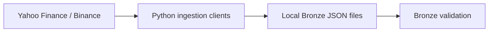

# Financial Market Data Ingestion

Small local ingestion project that fetches ASX equity, crypto, and FX reference data, stores raw API payloads as local JSON files, and validates the Bronze files.



## Scope

- Equities: `CBA.AX`, `BHP.AX`, `CSL.AX`, `WOW.AX`, `VAS.AX`
- Crypto: `BTCUSDT`, `ETHUSDT`, `SOLUSDT`, `BNBUSDT`, `XRPUSDT`
- FX reference: `AUDUSD=X`
- Default backfill: `2023-01-01`
- Current output: raw Bronze JSON plus validation results

## Setup

```powershell
python -m venv .venv
.\.venv\Scripts\Activate.ps1
pip install -r requirements.txt
```

## Run

Fetch data, store raw JSON files locally, and validate the Bronze files:

```powershell
python -m src.pipeline.run_daily --start-date 2023-01-01
```

Fetch a smaller date range:

```powershell
python -m src.pipeline.run_daily --start-date 2026-06-01 --end-date 2026-06-15
```

Outputs:

- `data/bronze/...`: raw JSON payloads from Yahoo and Binance
- `data/rejected/...`: invalid Bronze files moved only when quarantine is enabled

Example folder layout:

```text
data/
  bronze/
    equities/
      source=yahoo/
        date=YYYY-MM-DD/
          CBA.AX.json
    crypto/
      source=binance/
        date=YYYY-MM-DD/
          BTCUSDT.json
          ETHUSDT.json
          SOLUSDT.json
          BNBUSDT.json
          XRPUSDT.json
    fx/
      source=yahoo/
        date=YYYY-MM-DD/
          AUDUSD=X.json
```

Run validation for an existing Bronze run date:

```powershell
python -m src.validation.validate_bronze --run-date 2026-06-16
```

Quarantine invalid files only when you explicitly want to move them:

```powershell
python -m src.pipeline.run_daily --start-date 2026-06-01 --quarantine-invalid
```

The default validation rule fails the command if more than `25%` of expected Bronze files are invalid.

## Tests

```powershell
python -m pytest
```

## Future Enhancements

- Silver and Gold transformations
- PostgreSQL serving tables
- Airflow orchestration
- dbt models and tests
