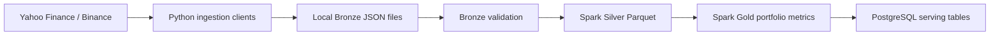

# Financial Market Data Ingestion

Small local market data project that fetches ASX equity, crypto, and FX reference data, stores raw API payloads as local JSON files, validates the Bronze files, transforms them into Silver Parquet tables, and builds Gold portfolio metrics.



## Scope

- Equities: `CBA.AX`, `BHP.AX`, `CSL.AX`, `WOW.AX`, `VAS.AX`
- Crypto: `BTCUSDT`, `ETHUSDT`, `SOLUSDT`, `BNBUSDT`, `XRPUSDT`
- FX reference: `AUDUSD=X`
- Default backfill: `2018-01-01`
- Current output: Bronze JSON, validation results, Silver Parquet, Gold portfolio metric Parquet, and PostgreSQL serving tables

## Setup

```powershell
python -m venv .venv
.\.venv\Scripts\Activate.ps1
pip install -r requirements.txt
```

## Run

Run the full local pipeline end to end:

```powershell
python -m src.pipeline.run_market_pipeline --start-date 2018-01-01 --spark-master local[1]
```

For local PostgreSQL loading, set your database password in the current PowerShell session first:

```powershell
$env:POSTGRES_PASSWORD="your_postgres_password"
```

Fetch data, store raw JSON files locally, and validate the Bronze files:

```powershell
python -m src.pipeline.run_daily --start-date 2018-01-01
```

Fetch a smaller date range:

```powershell
python -m src.pipeline.run_daily --start-date 2026-06-01 --end-date 2026-06-15
```

Outputs:

- `data/bronze/...`: raw JSON payloads from Yahoo and Binance
- `data/rejected/...`: invalid Bronze files moved only when quarantine is enabled

Example folder layout:

```text
data/
  bronze/
    equities/
      source=yahoo/
        date=YYYY-MM-DD/
          CBA.AX.json
    crypto/
      source=binance/
        date=YYYY-MM-DD/
          BTCUSDT.json
          ETHUSDT.json
          SOLUSDT.json
          BNBUSDT.json
          XRPUSDT.json
    fx/
      source=yahoo/
        date=YYYY-MM-DD/
          AUDUSD=X.json
```

Run validation for an existing Bronze run date:

```powershell
python -m src.validation.validate_bronze --run-date 2026-06-16
```

Quarantine invalid files only when you explicitly want to move them:

```powershell
python -m src.pipeline.run_daily --start-date 2026-06-01 --quarantine-invalid
```

The default validation rule fails the command if more than `25%` of expected Bronze files are invalid.

## Tests

```powershell
python -m pytest
```

## Spark

The reusable Spark session helper is:

```text
src/transformation/spark_session.py
```

Quick smoke test:

```powershell
python -c "from src.transformation.spark_session import build_spark_session, stop_spark_session; spark = build_spark_session('spark-smoke-test', 'local[1]'); print(spark.range(1).count()); stop_spark_session(spark)"
```

## Silver Transformation

Transform Bronze JSON files into Silver Parquet tables:

```powershell
python -m src.transformation.bronze_to_silver --run-date 2026-06-16 --master local[1]
```

This currently handles:

```text
Config asset list
  -> symbol/asset_class/source/currency metadata
  -> data/silver/assets/

Bronze Yahoo equities JSON
  -> Date/Open/High/Low/Close/Volume
  -> data/silver/asset_prices/

Bronze Binance crypto JSON
  -> open_time/open/high/low/close/volume
  -> data/silver/asset_prices/

Bronze Yahoo FX JSON
  -> Date/Close
  -> data/silver/fx_rates/
```

## Gold Portfolio Metrics

Transform Silver Parquet tables into Gold portfolio metrics:

```powershell
python -m src.transformation.silver_to_gold --master local[1]
```

Current fixed demo portfolio:

```text
40% VAS.AX
25% CBA.AX
15% BHP.AX
10% BTCUSDT
10% ETHUSDT
```

Current Gold outputs:

```text
data/gold/asset_returns/
  Per asset, per date:
  symbol, asset_class, source, price_date, native close price, AUD close price, currency, daily return

data/gold/portfolio_returns/
  Per portfolio, per date:
  portfolio_name, price_date, daily return, cumulative return

data/gold/portfolio_summary/
  One row per portfolio:
  portfolio_name, start date, end date, observation count, annual return,
  annual volatility, risk-free rate, Sharpe ratio, max drawdown

data/gold/date_spine/
  Daily calendar dates from the first Silver price date to the latest Silver price date

data/gold/asset_returns_calendar/
  Per asset, per calendar day:
  filled native close price, filled AUD close price, daily return,
  observed/forward-filled price flags, observed/forward-filled FX flags,
  source price date, source FX date

data/gold/portfolio_returns_calendar/
  Per portfolio, per calendar day:
  daily return, cumulative return, and fill-quality flags

data/gold/portfolio_summary_calendar/
  One row per portfolio using daily-calendar returns and 365-day annualization
```

Metric notes:

- `close_price_aud`: AUD assets stay unchanged. USDT crypto prices are divided by `AUDUSD=X`, treating USDT as USD-equivalent.
- `daily_return`: percentage change from the previous available AUD close price for the same asset.
- `portfolio_returns.daily_return`: weighted sum of each asset's daily return using the fixed target weights.
- `cumulative_return`: compounded portfolio return from the first available portfolio return date.
- `annual_return`: average daily portfolio return multiplied by `252` trading days.
- `annual_volatility`: daily return standard deviation multiplied by the square root of `252`.
- `sharpe_ratio`: `(annual_return - risk_free_rate) / annual_volatility`.
- `max_drawdown`: largest percentage fall from a previous portfolio value peak.
- Calendar-aware Gold tables keep strict actual-observation tables unchanged, but forward-fill missing prices and FX rates for dashboard-friendly daily timelines.
- Calendar-aware summary metrics use `365` days for annualization because those rows use calendar days, including weekends.

## PostgreSQL Serving Layer

Create PostgreSQL schemas and tables:

```powershell
python -m src.database.schema
```

Preview Gold Parquet row counts before loading:

```powershell
python -m src.database.load_gold --dry-run
```

Load Gold Parquet tables into PostgreSQL:

```powershell
python -m src.database.load_gold
```

Current PostgreSQL tables:

```text
gold.asset_returns
gold.date_spine
gold.asset_returns_calendar
gold.portfolio_returns
gold.portfolio_returns_calendar
gold.portfolio_summary
gold.portfolio_summary_calendar
audit.load_logs
```

Useful checks:

```sql
select count(*) from gold.asset_returns;
select count(*) from gold.date_spine;
select count(*) from gold.asset_returns_calendar;
select count(*) from gold.portfolio_returns;
select count(*) from gold.portfolio_returns_calendar;
select count(*) from gold.portfolio_summary;
select * from gold.portfolio_summary_calendar;
select * from audit.load_logs order by started_at desc;
```

## Future Enhancements

- Contribution planner for adding new money to the portfolio
- Optimized target portfolio weights
- Airflow orchestration
- dbt models and tests
