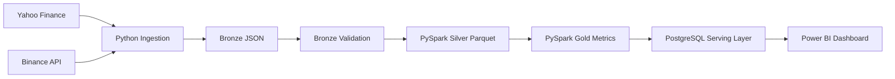
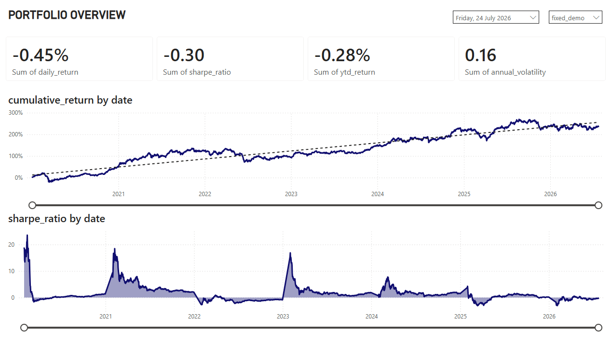
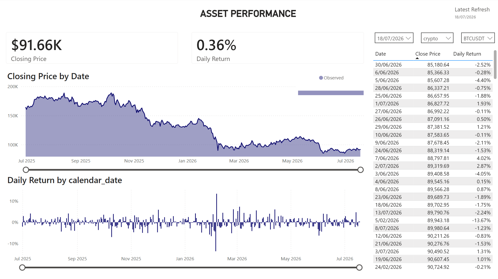
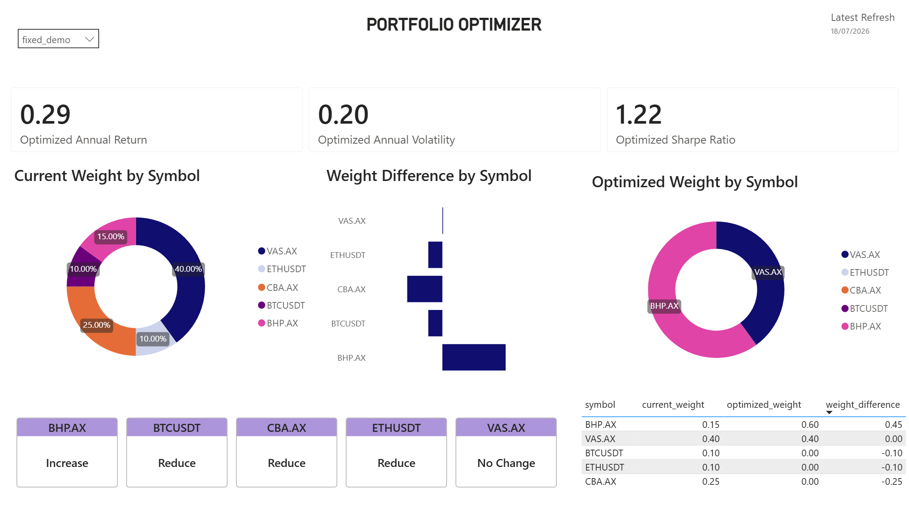

# Financial Market Data Platform

A local batch data platform for market data ingestion, validation, transformation, portfolio analytics, and Power BI reporting.

The project ingests ASX equities, crypto prices, and AUD/USD FX data, stores raw API responses as Bronze JSON, validates the raw files, transforms them with PySpark into Silver and Gold Parquet tables, loads dashboard-ready tables into PostgreSQL, and visualizes portfolio performance and allocation optimization in Power BI.

## Project Goal

The goal is to demonstrate an end-to-end data engineering and analytics workflow:

- collect data from external APIs
- preserve raw source data in a Bronze layer
- validate file and row quality before transformation
- use Spark to build structured Silver and Gold datasets
- serve analytics tables from PostgreSQL
- build a Power BI dashboard for portfolio analysis

This is a portfolio project focused on data platform architecture. The portfolio optimizer is based on historical returns and is not intended to predict future investment performance.

## Architecture



## Data Sources

| Source | Assets | Purpose |
| --- | --- | --- |
| Yahoo Finance | `CBA.AX`, `BHP.AX`, `CSL.AX`, `WOW.AX`, `VAS.AX` | ASX equity price history |
| Binance API | `BTCUSDT`, `ETHUSDT`, `SOLUSDT`, `BNBUSDT`, `XRPUSDT` | Crypto daily candles |
| Yahoo Finance | `AUDUSD=X` | AUD conversion for USD/USDT assets |

Key assumptions:

- USDT is treated as USD-equivalent for MVP reporting.
- AUD assets are stored in AUD and do not require FX conversion.
- Missing calendar dates are forward-filled only in calendar-aware Gold tables.
- Optimized portfolio outputs use historical returns, not future forecasts.

## Repository Structure

```text
src/
  ingestion/        API clients and Bronze JSON writing
  validation/       Bronze file validation checks
  transformation/   Spark Silver/Gold transformations and optimizer
  database/         PostgreSQL schema creation and Gold table loading
  pipeline/         End-to-end orchestration entry points
  utils/            Shared configuration and logging helpers

tests/              Unit and integration tests
docs/               Supporting project documentation
visual/             Architecture diagram source
data/               Local generated Bronze/Silver/Gold data, gitignored
logs/               Local pipeline logs, gitignored
```

## Data Layers

### Bronze

Bronze stores raw API payloads exactly as received.

```text
data/bronze/equities/source=yahoo/date=YYYY-MM-DD/{symbol}.json
data/bronze/crypto/source=binance/date=YYYY-MM-DD/{symbol}.json
data/bronze/fx/source=yahoo/date=YYYY-MM-DD/AUDUSD=X.json
```

The Bronze layer is intentionally raw so the project keeps a reproducible copy of the source responses.

### Validation

Bronze validation checks for common data quality problems before Spark transformations run.

Examples:

- missing expected files
- empty files
- invalid JSON
- missing records
- missing timestamps
- negative price or volume values
- duplicate dates

Invalid files can be reported or quarantined into `data/rejected/`. The default policy fails the pipeline if more than 25% of expected Bronze files are invalid.

### Silver

Silver converts raw JSON into clean, structured Parquet tables.

```text
data/silver/assets/
data/silver/asset_prices/
data/silver/fx_rates/
```

Main meaning:

- `assets`: asset metadata such as symbol, asset class, source, and currency
- `asset_prices`: normalized daily OHLCV price history
- `fx_rates`: normalized AUD/USD FX reference rates

### Gold

Gold contains the dashboard-ready star schema used by PostgreSQL and Power BI.

```text
data/gold/dim_date/
data/gold/dim_asset/
data/gold/dim_portfolio/
data/gold/fact_asset_daily/
data/gold/fact_portfolio_daily/
data/gold/fact_portfolio_summary_daily/
data/gold/fact_optimizer_summary/
data/gold/fact_optimizer_weights/
```

Important Gold outputs:

- `dim_date`: one row per calendar date with year, month, day, and weekend attributes
- `dim_asset`: one row per asset with asset class, source, currency, and active flag
- `dim_portfolio`: one row per portfolio used in the dashboard
- `fact_asset_daily`: one row per asset per calendar day with AUD prices, returns, and fill-quality flags
- `fact_portfolio_daily`: one row per portfolio per calendar day with daily and cumulative return
- `fact_portfolio_summary_daily`: year-to-date portfolio KPI snapshot by date
- `fact_optimizer_summary`: historical max-Sharpe optimizer KPI result
- `fact_optimizer_weights`: current weight, optimized weight, and weight difference by asset

## Portfolio Logic

The fixed demo portfolio is:

| Symbol | Weight |
| --- | ---: |
| `VAS.AX` | 40% |
| `CBA.AX` | 25% |
| `BHP.AX` | 15% |
| `BTCUSDT` | 10% |
| `ETHUSDT` | 10% |

Portfolio metrics include:

- daily return
- cumulative return
- year-to-date return
- annualized return
- annualized volatility
- Sharpe ratio
- max drawdown

Gold facts use calendar-aware returns and 365 days for annualization because dashboard timelines include weekends. Portfolio summary facts store `ytd_return` as the compounded return from the start of the year to the selected date. Annualized return, annualized volatility, and Sharpe ratio are left blank until at least 30 observations exist, which avoids misleading early-year values.

## Optimizer

The optimizer uses `scipy.optimize.minimize` with SLSQP to maximize historical Sharpe ratio from `fact_asset_daily`.

MVP constraints:

- weights must sum to 100%
- no short selling
- max 60% in one asset
- max 25% total crypto allocation
- max 15% in one crypto asset

The optimizer writes two dashboard-ready Gold outputs:

```text
gold.fact_optimizer_summary
gold.fact_optimizer_weights
```

## PostgreSQL Serving Layer

Gold Parquet outputs are loaded into PostgreSQL tables for Power BI.

Current serving tables:

```text
gold.dim_date
gold.dim_asset
gold.dim_portfolio
gold.fact_asset_daily
gold.fact_portfolio_daily
gold.fact_portfolio_summary_daily
gold.fact_optimizer_summary
gold.fact_optimizer_weights
audit.load_logs
```

The MVP load mode is truncate-and-reload.

## Power BI Dashboard

The Power BI report is designed around three pages.

### 1. Portfolio Overview

Shows the fixed portfolio performance over time.

Main visuals:

- daily return card
- Sharpe ratio card
- annual return card
- annual volatility card
- cumulative return over time
- daily return over time

### 2. Asset Performance

Shows individual asset price and return behaviour.

Main visuals:

- closing price card
- daily return card
- closing price over time
- daily return by date
- latest asset price table

Useful data quality fields:

- `is_price_observed`
- `is_price_forward_filled`
- `is_fx_observed`
- `is_fx_forward_filled`

### 3. Portfolio Optimizer

Compares the current fixed portfolio with the optimized historical max-Sharpe allocation.

Main visuals:

- optimized annual return
- optimized annual volatility
- optimized Sharpe ratio
- current weight by symbol
- optimized weight by symbol
- weight difference by symbol
- allocation action table

## Setup

Create and activate a virtual environment:

```powershell
python -m venv .venv
.\.venv\Scripts\Activate.ps1
pip install -r requirements.txt
```

Set PostgreSQL connection values in the current PowerShell session:

```powershell
$env:POSTGRES_HOST="127.0.0.1"
$env:POSTGRES_PORT="5432"
$env:POSTGRES_DATABASE="finance_data_market"
$env:POSTGRES_USER="postgres"
$env:POSTGRES_PASSWORD="your_postgres_password"
```

The default PostgreSQL values are also defined in `src/utils/config.py`.

## Run The Pipeline

Run the full local pipeline:

```powershell
python -m src.pipeline.run_market_pipeline --start-date 2026-01-01 --spark-master local[1]
```

This runs:

1. Bronze ingestion and validation
2. Bronze to Silver Spark transformation
3. Silver to Gold Spark transformation and optimizer
4. Gold Parquet to PostgreSQL load

Run without loading PostgreSQL:

```powershell
python -m src.pipeline.run_market_pipeline --start-date 2026-01-01 --spark-master local[1] --skip-postgres
```

Run only ingestion and validation:

```powershell
python -m src.pipeline.run_daily --start-date 2026-01-01
```

Run only Bronze to Silver:

```powershell
python -m src.transformation.bronze_to_silver --run-date 2026-07-18 --master local[1]
```

Run only Silver to Gold:

```powershell
python -m src.transformation.silver_to_gold --master local[1]
```

Run only the optimizer:

```powershell
python -m src.transformation.portfolio_optimizer --master local[1]
```

Preview PostgreSQL load row counts:

```powershell
python -m src.database.load_gold --dry-run
```

Load Gold tables into PostgreSQL:

```powershell
python -m src.database.load_gold
```

## Useful SQL Checks

```sql
select count(*) from gold.fact_asset_daily;
select count(*) from gold.fact_portfolio_daily;
select * from gold.fact_portfolio_summary_daily order by date_key desc limit 10;
select * from gold.fact_optimizer_summary;
select * from gold.fact_optimizer_weights order by weight_difference desc;
select * from audit.load_logs order by started_at desc;
```

## Tests

Run the test suite:

```powershell
python -m pytest
```

Test coverage includes:

- Yahoo response normalization
- Binance response normalization
- Bronze validation rules
- Spark session creation
- Bronze to Silver transformations
- Silver to Gold metrics
- portfolio optimizer constraints
- pipeline orchestration behaviour

## Configuration

Main configuration lives in:

```text
src/utils/config.py
```

This includes:

- asset symbols
- default start date
- data folder paths
- validation failure threshold
- annualization settings
- risk-free rate
- fixed portfolio weights
- default PostgreSQL connection values

## Notes For Reviewers

This project is intentionally local-first. It prioritizes a clear data engineering workflow over production infrastructure.

Production-oriented extensions would include:

- Dockerized PostgreSQL and Spark runtime
- Airflow orchestration
- dbt models and tests for the serving layer
- incremental loading instead of truncate-and-reload
- richer data quality reporting
- contribution planner for new investment amounts
- future ML or forecasting layer
